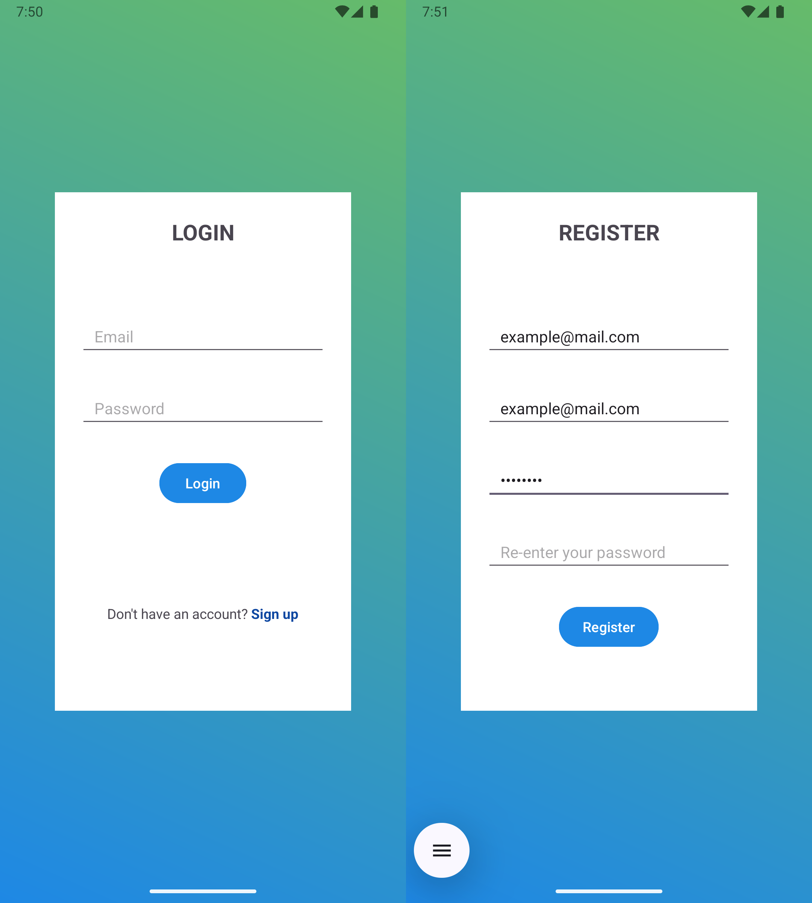
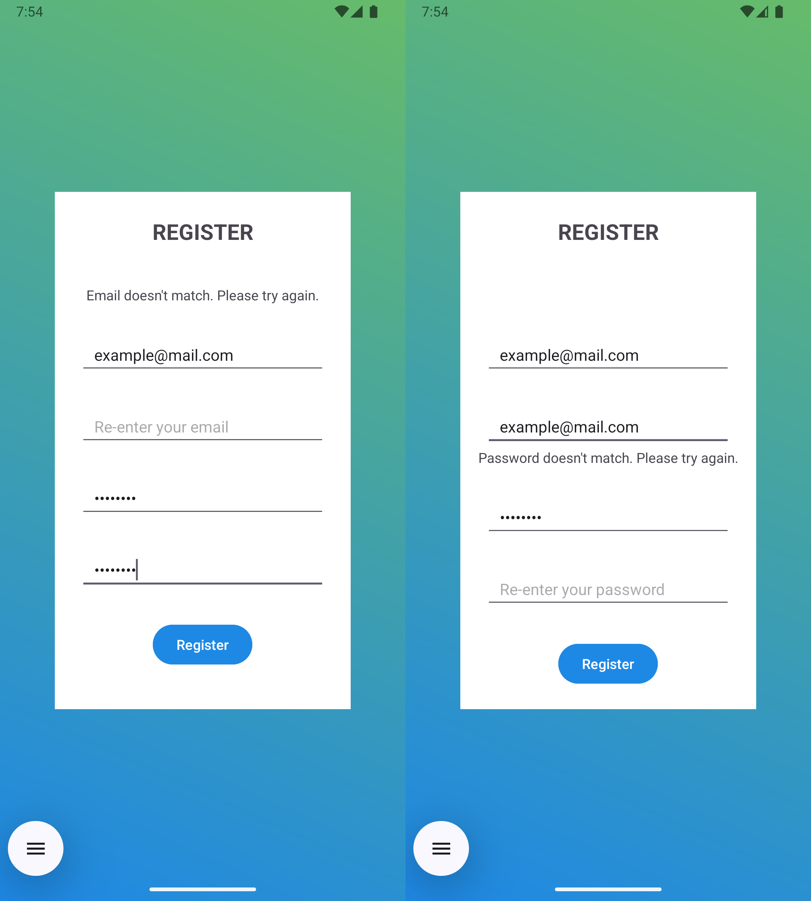
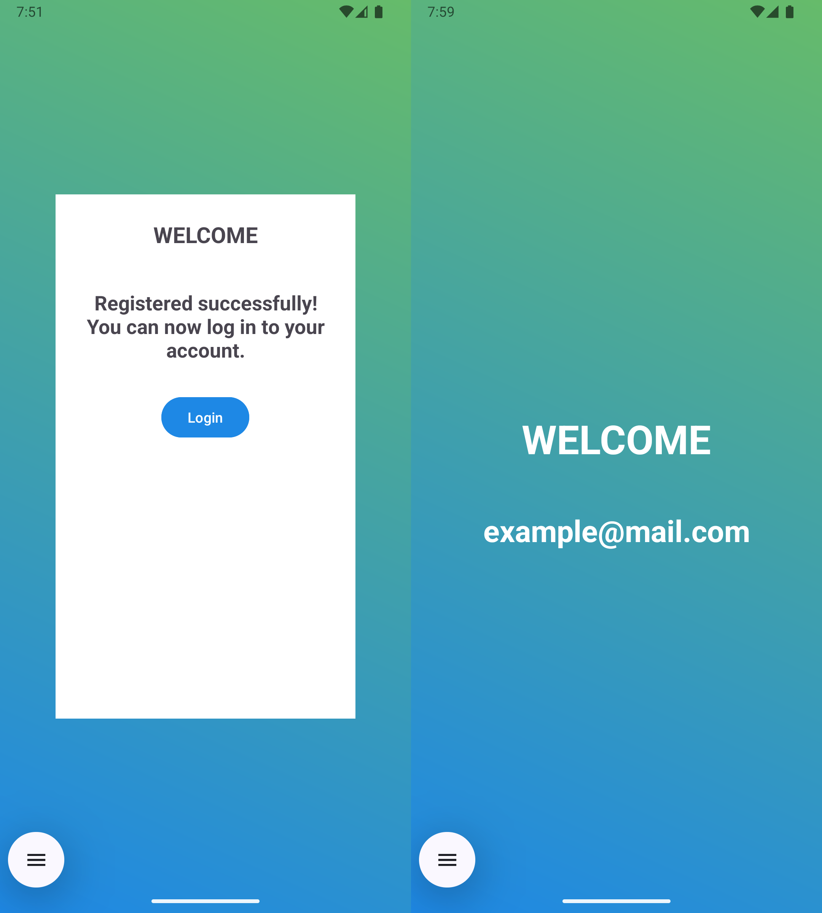

# SimpleLoginApp

**SimpleLoginApp** is a beginner-friendly Android application built using Java and Room Database. It allows users to register and log in with basic validation and local data storage. The goal of this project is to learn and demonstrate how user authentication works in a native Android environment.

## Features

- 📝 Register a new user with email and password  
- 🔐 Log in using saved credentials  
- 💾 Local user storage with Room Database  
- 🧠 Basic input validation and helpful error messages  
- ✅ Welcome screen after successful login

## Technologies Used

- Java  
- Android SDK  
- Room Persistence Library (SQLite)  
- XML Layouts

## Screenshots

| Registration | Verification | Welcome |
|--------------|--------------|-------------|
|  |  |  |

## Why I Built This

I created this app to solidify my understanding of user authentication, data persistence, and UI state handling in Android. The goal is to connect and apply the core concepts I’ve learned so far **before transitioning to web-based development using Spring Boot and PostgreSQL**. This project helps me deepen my logic and architectural thinking in preparation for more complex backend systems.

> ⚠️ **Disclaimer**: This app is for learning purposes only and is not intended for production use without significant security enhancements.

